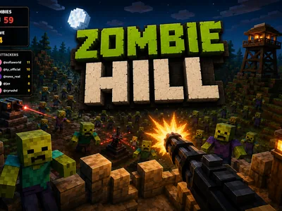

# Zombie Hill - Interactive TikTok Live Game

> Your whole chat is the horde climbing the hill.

A first-person zombie defense shooter where your whole chat is the horde. Every viewer who joins or gifts spawns a zombie wearing their name, and your gun tracks and drops them while you talk. Gifts also send medkits, turrets and shields to help you survive.

**[Play Zombie Hill on Livecade](https://livecade.io/games/zombie-hill/?utm_source=github&utm_medium=readme&utm_campaign=zombie-hill)** - runs as a single browser source in OBS, Streamlabs, or TikTok LIVE Studio. Nothing for viewers to install.

## How viewers play

Viewers take part with the actions TikTok already gives them: **gifts**, **comments**, **likes**, **follows**, **shares**. Every action below is rebindable, so you decide which interaction drives which effect.

| Action | What it does |
| --- | --- |
| **Spawn enemy (per zombie type)** | Sends a zombie wearing the viewer's name up the hill. The type and how many are both configurable per trigger |
| **Medkit** | Heals your base health so a bad wave does not end the run |
| **Overdrive** | Ten seconds of rapid fire to clear a horde that got too close |
| **Shield** | Ten seconds of heavily reduced damage to your base |
| **Freeze** | Slows every zombie on the field for eight seconds |
| **Auto turret** | Builds a permanent turret that fires on its own and cannot be attacked |
| **Tesla tower** | Builds a tower that chains lightning between zombies and cannot be attacked |
| **Spinning blade** | Builds a melee blade that shreds anything close, but zombies can destroy it |
| **Barbed wire** | Blocks and scrapes zombies as they try to climb past it |

## How it works

### Every viewer becomes a zombie

Joining, commenting, liking, following or sharing spawns a zombie wearing that viewer's username on a nameplate, so people watch the hill for their own name in the crowd.

### The gun aims itself

Your mounted gun tracks and drops zombies on its own, alternating between picking off individual targets and raking the front rank. You never have to aim, so you can keep talking to chat while the hill fills up.

### Gifts attack you, or save you

The gift ladder runs from cheap swarms up to giants and twenty-strong skeleton hordes. But chat can also send medkits, overdrive, shields and freezes, or build turrets, tesla towers, blades and barbed wire that fight for you.

## About the game

Zombie Hill puts you on a hilltop with a mounted gun and turns your entire chat into the horde climbing up at you. Every viewer who joins, comments, likes, follows or shares spawns a zombie wearing their username on a nameplate, so people watch the field for their own name.

### The gun aims itself, so you keep talking

It tracks and drops them on its own, alternating between picking off individual targets and raking the front rank, so you never have to aim and can keep talking to chat while the hill fills up.

### Gifts cut both ways

The attack ladder runs from cheap swarms of walkers, crawlers and bats up through runners, armoured helmets and dogs, then special units with real abilities, bone-throwers that attack at range, screamers that speed up the whole horde, shielded mages that summon minions, and finally a boss tier of giants and twenty-strong skeleton swarms. But chat can also help you survive: a medkit, a ten-second overdrive, a shield, a freeze that slows every zombie on the field, or permanent defenses like an auto turret, a tesla tower, a spinning blade or barbed wire.

### Kills bank score and rank you up

Thirteen military ranks from Private to General, a kill feed naming who sent each zombie you dropped, and a top-attackers board ranking the viewers doing the most damage. Let a zombie reach the sandbags and it costs your base health. Four difficulty presets, a configurable horde cap, and twelve languages.

## Gameplay

[Watch Zombie Hill gameplay](https://cdn.livecade.io/games/zombie-hill.mp4)

## What you can configure

- **Interface language** - Twelve languages for the on-screen chrome
- **Difficulty** - Easy, Normal, Hard or Insane. Sets enemy speed, toughness and your fire rate together, while each zombie type keeps its own character
- **Base health** - How much your base takes before the run ends
- **Max zombies on screen** - Caps the live horde so a big raid cannot outrun your hardware
- **Show top attackers** - Ranks viewers by how many zombies they sent that you killed
- **Practice zombies when quiet** - Keeps a small horde climbing when no viewer is attacking, so the hill never sits empty

## Languages

English, Spanish, Portuguese, French, German, Italian, Indonesian, Arabic, Turkish, Russian, Hindi, Romanian

## FAQ

<strong>How do viewers join Zombie Hill?</strong>

Joining, commenting, liking, following or sharing all spawn a zombie wearing that viewer's username, so anyone watching takes part for free. Every trigger is rebindable to your own thresholds.

<strong>Do I have to aim and shoot?</strong>

No. The gun tracks and drops zombies on its own, alternating between picking off individual targets and raking the front rank, so you can keep talking to chat while it fights. Your job is surviving the horde your viewers send.

<strong>Do viewers need to send gifts to play?</strong>

No. Free actions like joining, commenting and liking already put a viewer in the horde. Gifts decide what arrives, from cheap swarms up to giants, and can also send medkits, shields and permanent defenses that help you survive.

<strong>Can my chat help me instead of attacking?</strong>

Yes. Gifts can send a medkit, a ten-second overdrive, a shield, or a freeze that slows the whole field, and can build permanent defenses: an auto turret, a tesla tower, a spinning blade, or barbed wire. Defense kills credit the viewer who paid for the turret.

<strong>How do I add Zombie Hill to my TikTok Live?</strong>

Add one browser source URL to OBS or your streaming software and go live. There is no plugin to install and nothing for your viewers to download.

## Setup

1. [Create a Livecade account](https://app.livecade.io/register?utm_source=github&utm_medium=cta&utm_campaign=zombie-hill)
2. Copy your overlay browser source URL
3. Paste it into OBS, Streamlabs, or TikTok LIVE Studio
4. Pick Zombie Hill, set your triggers, and go live

Runs in the browser, so it works on Windows and macOS with nothing to download. [See all TikTok Live games](https://livecade.io/tiktok-live-games/?utm_source=github&utm_medium=readme&utm_campaign=zombie-hill).

---

_This repository documents Zombie Hill, a hosted interactive game by [Livecade](https://livecade.io/?utm_source=github&utm_medium=footer&utm_campaign=zombie-hill). The game runs on Livecade's platform, so there is no source to install here._
